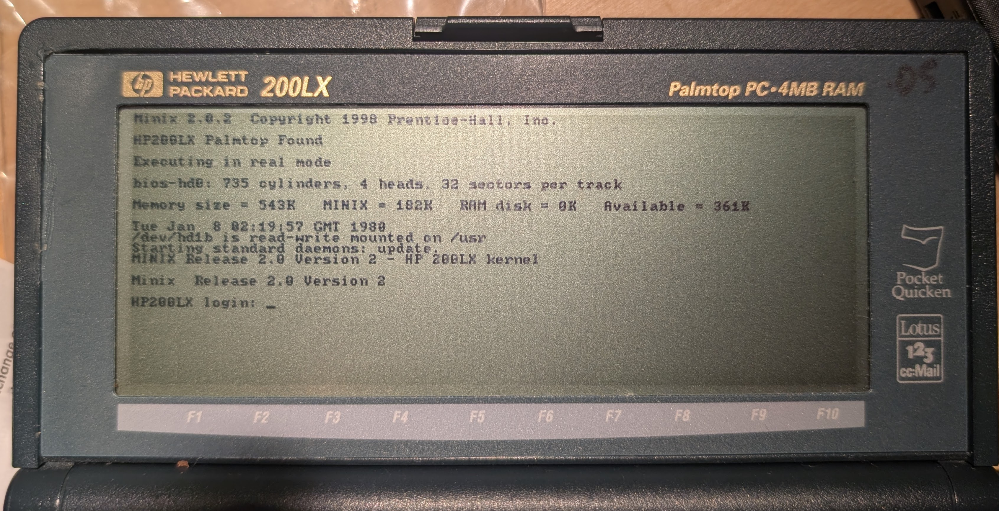
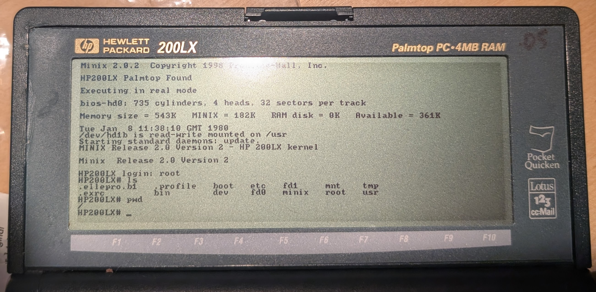
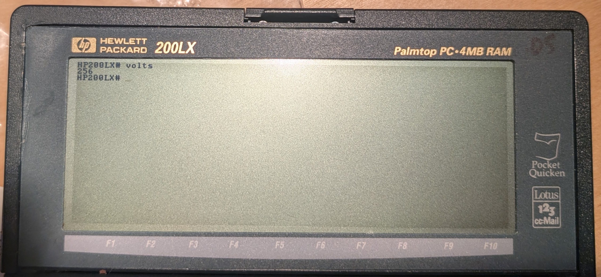
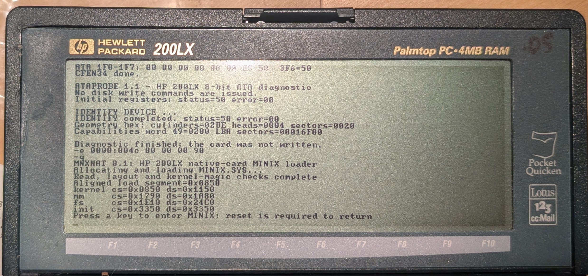
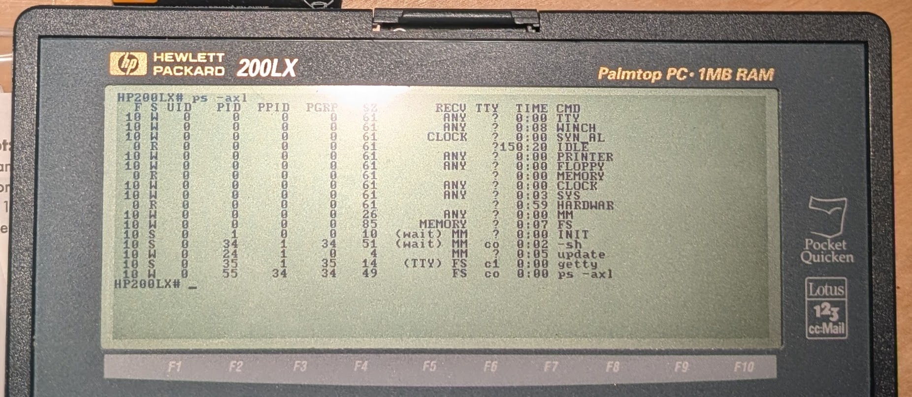
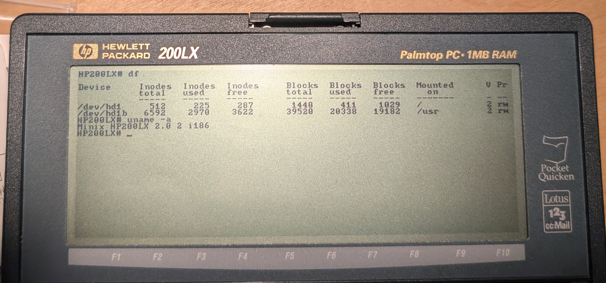

# MINIX 2 on the HP 200LX

This project runs **MINIX Release 2.0 Version 2** on an HP 200LX and uses a
native MINIX filesystem on a PCMCIA/CompactFlash card for persistent storage.
Release 1.0 has been validated on both standard and double-speed-modified
HP 200LX hardware.



*MINIX Release 2.0 Version 2 at the HP 200LX login prompt.*

The HP 200LX still starts in DOS. A small DOS boot bundle configures the CF
card, installs Richard L. Dubs's BIOS INT 13 bridge, loads Mack Baggette's
HP-compatible MINIX kernel, and transfers control directly to it. MINIX then
mounts the native card as `/` and `/usr`; unlike DOSMINIX, it does not use a
`MINIX.MNX` file-as-disk filesystem after boot.

> This is an experimental historical-computing project. Writing the image
> overwrites the selected card. Verify the target device before continuing.

## Release 1.0

Release 1.0 includes:

- a 48,103,424-byte whole-card image with a persistent native MINIX filesystem;
- the exact nine-file `MNXBOOT` DOS bundle proven on the hardware;
- Mack's HP 200LX-compatible MINIX kernel;
- Richard Dubs's PCMCIA and BIOS INT 13 bridge;
- the CF initialization sequence developed during the HP 200LX ELKS work;
- hostname and root prompt `HP200LX`;
- `/etc/issue`: `MINIX Release 2.0 Version 2 - HP 200LX kernel`;
- Mack's `volts` utility in `/usr/local/bin`.

The release image starts cleanly without an unnecessary first-boot filesystem
check. A genuinely unclean later shutdown still triggers MINIX's normal check.



*Logged in as root with native `/` and `/usr` filesystems mounted from the
PCMCIA/CF card.*

## Motivation And Lineage

This work was triggered by PalmtopTube's video
[Running Minix on the HP 200LX, a UNIX-like OS](https://www.youtube.com/watch?v=MNDON2kHQbQ).

It integrates ideas and artifacts from three earlier efforts:

1. **Richard L. Dubs's MINIX on the HP 200LX**
   ([original MINIX 2.0.2 archive](https://web.archive.org/web/20030208003008/http://www.cs.vu.nl/pub/minix/2.0.2/),
   [Dubs archive](https://web.archive.org/web/20000919213847/http://users.erols.com/rld/)).
   Dubs solved the difficult PCMCIA I/O activation and BIOS disk-service
   problem and booted a native MINIX card. His notes report that MINIX was
   unstable after reaching login, usually allowing at most one command.
2. **Mack Baggette's DOSMINIX port**
   ([legacy project page](https://hp200lx.3peakspublishing.com/minix/index-legacy.html)).
   Mack customized the kernel for the HP 200LX's hardware and produced a
   stable system, but it normally ran from the DOSMINIX file-as-disk design and
   did not provide native PCMCIA storage support.
3. **ELKS Linux on the HP 200LX**
   ([l00nix/elks-on-hp200lx](https://github.com/l00nix/elks-on-hp200lx)).
   That work demonstrated a repeatable DOS-loader handoff followed by a
   persistent Minix-filesystem root on PCMCIA/CF. Its card initialization work,
   especially `CFEN34`, directly informed the sequence used here.

This is an integration of those approaches, not a source-level merger of the
MINIX and ELKS kernels.

## What Works

- MINIX 2.0.2 reaches a normal login and shell on the HP 200LX.
- `/` and `/usr` are persistent native MINIX filesystems on the CF card.
- Files survive `sync`, shutdown, and reboot.
- The built-in keyboard works.
- HP-specific key combinations tested so far, including display zoom, work.
- A double-speed-modified HP 200LX is supported. Load `DSPEED` under DOS to
  eliminate screen flicker, then run `DSPEED /R` before `MNXBOOT` to unload it,
  recover its conventional memory, and avoid changing the MINIX handoff.
- The CF card may remain inserted while rebooting into DOS; `MNXBOOT.BAT`
  reinitializes it before entering MINIX.
- The same Release 1.0 image boots from both 48 MB and 256 MB CF cards. The card
  does not need to be a particular model or exact size, but it must be at least
  48,103,424 bytes and compatible with the HP 200LX PCMCIA adapter.
- `volts` reports the main-battery voltage. It omits the decimal point, so
  `243` means approximately 2.43 V.



*Mack's `volts` utility reporting 2.56 V; its output is expressed in hundredths
of a volt.*

## Known Limitations

- The HP ON/OFF function may work once, but resuming can hang. Do not rely on
  suspend/resume; save files, run `sync`, and shut down normally.
- CF cards and adapters vary; Release 1.0 has been tested with 48 MB and 256 MB
  cards, but not every available model.
- PCMCIA networking is not included or validated.
- This is a research build for vintage hardware, not a maintained secure OS.

## Install

You need:

- an HP 200LX that can boot to its internal DOS `C:` drive;
- enough internal DOS space for the `MNXBOOT` directory;
- a compatible PCMCIA/CF card at least 48,103,424 bytes in size;
- a separate DOS-readable transfer card or another way to copy files to `C:`.

1. Download both Release 1.0 assets:
   - `HP200LX-MINIX-2.0.2-native-1.0.img`
   - `MNXBOOT-Release-1.0.zip`
2. Verify their SHA-256 checksums from the release page.
3. Write the `.img` to the entire CF device, not to a partition. Capacity beyond
   the 48,103,424-byte image remains unused.
4. Extract the boot ZIP and copy its `MNXBOOT` directory to `C:\MNXBOOT` on
   the HP 200LX internal DOS drive.
5. Insert the imaged native MINIX CF card.
6. At the DOS prompt run:

   ```dos
   C:
   CD \MNXBOOT
   MNXBOOT
   ```

7. `MNXNAT` validates and loads `MINIX.SYS`. Press a key at its final prompt.
8. A successful boot reports `HP200LX Palmtop Found`, detects `bios-hd0`,
   mounts `/usr`, and reaches the MINIX login prompt.

The native MINIX card is intentionally not DOS-readable as `A:`.

Always finish a MINIX session with:

```text
sync
shutdown
```

## Boot Sequence

The frozen DOS sequence is:

```dos
CARDIO.EXE
CFEN34.COM
ATAPROB.COM I
DEBUG < VECT13.DAT
PUT13.EXE
MNXNAT.COM
```

See [docs/BOOT-SEQUENCE.md](docs/BOOT-SEQUENCE.md) for the purpose of every
stage and the comparison with the Dubs and ELKS paths.



*The DOS-side card initialization, ATA check, and `MNXNAT` handoff immediately
before entering MINIX.*

## Filesystem Image

The card uses a bootable type-81 MINIX partition beginning at sector 32. It
contains separate root and `/usr` filesystems and mounts them as `/dev/hd1`
and `/dev/hd1b`.

See [docs/IMAGE-LAYOUT.md](docs/IMAGE-LAYOUT.md) for exact offsets, sizes, and
verification details.

## Source And Rebuilding

The `source` directory contains the source available for the new loader and
diagnostic helpers. `MNXNAT.COM` is assembled from `MNXLOAD.ASM` with:

```text
nasm -f bin -DHANDOFF -DNATIVE MNXLOAD.ASM -o MNXNAT.COM
```

The checked-in `boot/MNXBOOT` binaries are the exact real-hardware-tested
Release 1.0 files. Their hashes are recorded in `SHA256SUMS.txt`.

## Additional Screenshots



*`ps -axl` showing active MINIX tasks and processes, including each process's
allocated size in the `SZ` column.*



*`df` showing the native root filesystem on `/dev/hd1` and `/usr` on
`/dev/hd1b`, followed by `uname -a` identifying the HP 200LX MINIX 2.0.2
system.*

## Licensing

MINIX 2.0.2 is subject to the Prentice-Hall educational and research license,
including its restriction that qualifying third-party distribution be free of
direct or indirect charge. Other components retain their respective original
copyrights and terms. No project-wide relicensing of third-party material is
claimed here.

Read [THIRD_PARTY_NOTICES.md](THIRD_PARTY_NOTICES.md) and the files under
[`licenses/`](licenses/) before redistributing the image or binaries.

## Credits

- Andrew S. Tanenbaum, Prentice-Hall, and the MINIX authors.
- Mack Baggette for the stable HP 200LX kernel customizations and LX utilities.
- Richard L. Dubs for the HP 200LX PCMCIA I/O and BIOS INT 13 work.
- The ELKS project, Greg Haerr, and the HP 200LX ELKS contributors.
- PalmtopTube for the video that prompted this experiment.
